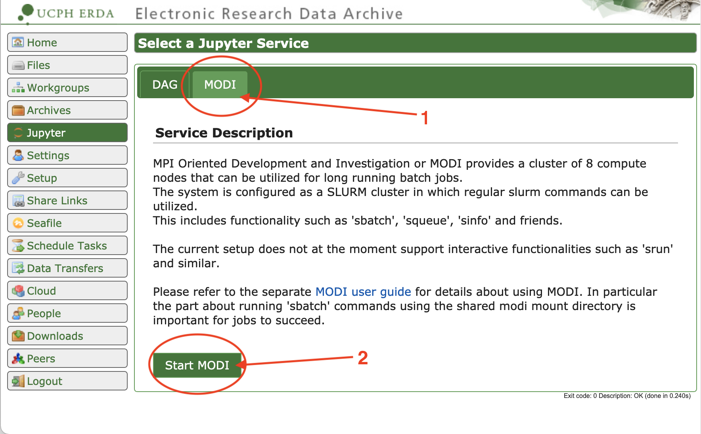
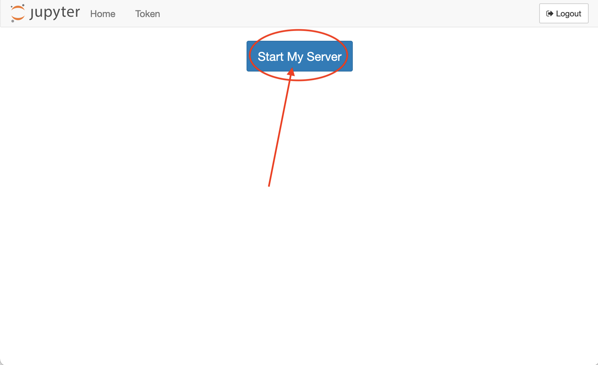
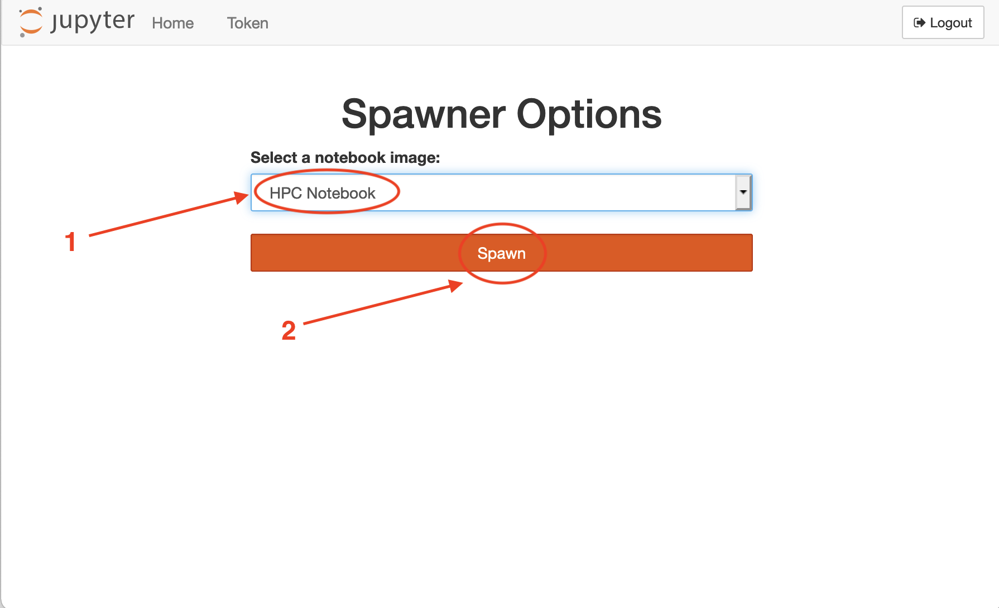
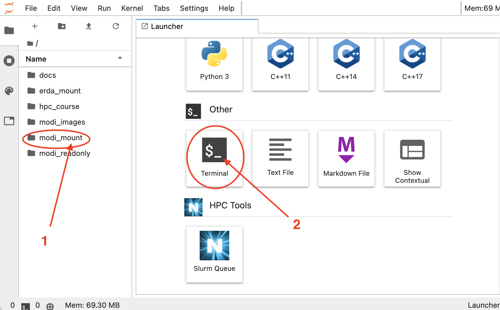
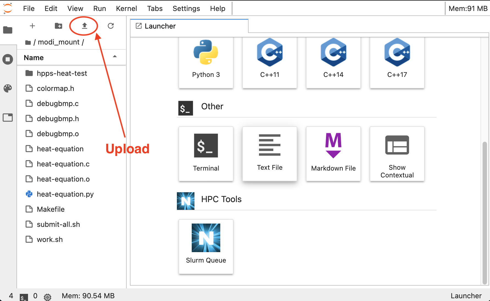

# Running a program on MODI using Slurm

When using a large shared machine you cannot just log in and run your code. To ensure the that all users get their share, and to ensure that each execution is independent, you can only submit jobs into the shared queue. For most installations, and MODI in particular, this means using [Slurm](https://slurm.schedmd.com/overview.html).

## Getting access to MODI

Before you can access MODI, you need to [set up an account on ERDA](https://erda.ku.dk), using your regular UCPH login.

After you have logged in, you need to start the Jupyter service:


Then choose the MODI tab and click "Start MODI":


On the MODI Jupyter service page click "Start my server":


Then make sure you have HPC Notebook (should be default) and click "Spawn":


After a small waiting period, you will get a Jupyter start page, and have access to the MODI front-end server.

For most systems, and MODI in particular, the front-end server is a trimmed down versions of the real servers. The machine has build tools matching the target servers, allowing you to compile and run small tests directly on the frontend.

## Upload your files

Before starting the upload, make sure you have tested your application as much as possible on your own machine. It is possible to debug via a queue based system, but it is a slow and unplesant process.

As we will need to run our binary on the execution nodes, we need to upload into the `modi_mount` directory. This is required because the execution nodes do not get your credentials, and cannot access any of the files stored on ERDA. You can mount ERDA temporarily on MODI, but that is not required for HPPS.


After you have selected the `modi_mount` directory, you can start uploading the files. In the example here, I have uploaded everything, including the `Makefile`. 


## Compiling on MODI

All tools are installed and optimized for running on MODI, including `Make`, `GCC` and `OpenMP`. If you are using the `Makefile` from the source code handout, you can just compile, but make sure you disable debugging. The `DEBUG` macro can be used to toggle this, so you could run the following:

```bash
> cd ~/modi_mount
> make clean
rm -rf heat-equation *.o *.dSYM
> DEBUG=-O1 make
cc -c heat-equation.c -Wextra -Wall -pedantic -std=c99 -fopenmp -O1
cc -c debugbmp.c -Wextra -Wall -pedantic -std=c99 -fopenmp -O1
cc -o heat-equation heat-equation.o debugbmp.o -lm -fopenmp
```

**Note:** Do not use the binary from your own machine. It may or may not work, but it is likely not optimized for the CPU used on MODI.

After compilation, verify that the binary works with something like this:
```bash
> OMP_NUM_THREADS=1 ./heat-equation 50 50 10
After 10 iterations, delta was 1.108848
```

## Running a single job

With a compiled binary, you are now ready to submit a job. However, slurm works best with scripts, so we need to write a small wrapper that emits some results we will need later. Create a file called `work.sh` with the following contents:
```bash
#!/bin/bash
export OMP_NUM_THREADS=${1}
echo "Running (${2}x${3}:${4}) with ${OMP_NUM_THREADS} threads"
time ./heat-equation ${2} ${3} ${4}
```

This will serve as a script for running the executable where we can change the parameters as we want. To submit the very first job, we can run the `sbatch` command:
```bash
> sbatch --exclusive work.sh 1 1000 1000 1000
Submitted batch job 29249
```

You will then get job-id that you can use with `squeue -j 29249` to see the status. It will also create an empty file with the name `slurm-29249.out`. Once the job starts running, it will write output to this file. You can monitor the file with `tail -f slurm-29249.out`, which will interactively update the output file when the job is running (press CTRL+C to stop watching the file; this will not cancel the job).

You might want to try running a single job with different workloads sizes and threads, to see that your speedups work, and to pick a good size workload for multiple threads.

## Running multiple tasks

When you have tested a single task and confirmed that it works as expected, it is time to measure the performance of your solution. For this we want to run the same program, same workload, but with different thread counts. We have already created a helper script to launch a single job, and we can use that to submit multiple jobs, with a submission script like this (call it `submit-all.sh`):

```bash
#!/bin/bash

WIDTH=1000
HEIGHT=1000
ROUNDS=1000

for n in {1..64}; do
  sbatch --exclusive work.sh ${n} ${WIDTH} ${HEIGHT} ${ROUNDS}
done
```

This script will invoke `sbatch` 64 times, varying the 1st parameter, which the `work.sh` script uses for the number of threads. When you run the script, you will see a list of job-ids. You can then use `squeue` to see if they are finished. Once they are finished, you can pick out the results from the files and put them into your favorite graph creation format. You will notice that `work.sh` writes the input parameters, which will help you when you have 64+ output files and try to figure out which goes where.

## Running long-running tasks

If your experiment with larger workloads, you can experience that the jobs are killed after 15 minutes. This is caused by the default queue on MODI allowing only short tasks. To see what queues are available, use the `sinfo` command:

```bash
> sinfo

PARTITION   AVAIL  TIMELIMIT  NODES  STATE NODELIST
modi_devel*    up      15:00      5   idle modi[003-007]
modi_devel*    up      15:00      3   down modi[000-002]
modi_short     up 2-00:00:00      5   idle modi[003-007]
modi_short     up 2-00:00:00      3   down modi[000-002]
modi_long      up 7-00:00:00      5   idle modi[003-007]
modi_long      up 7-00:00:00      3   down modi[000-002]
modi_max       up 29-00:00:0      5   idle modi[003-007]
modi_max       up 29-00:00:0      3   down modi[000-002]
```

You can see that `modi_short` allows tasks to run up to two hours. To run on another queue (aka partition) with Slurm, use the `--partition=` argument, like so:
```bash
> sbatch --partition=modi_short --exclusive work.sh 1 1000 1000 1000
Submitted batch job 29249
```
